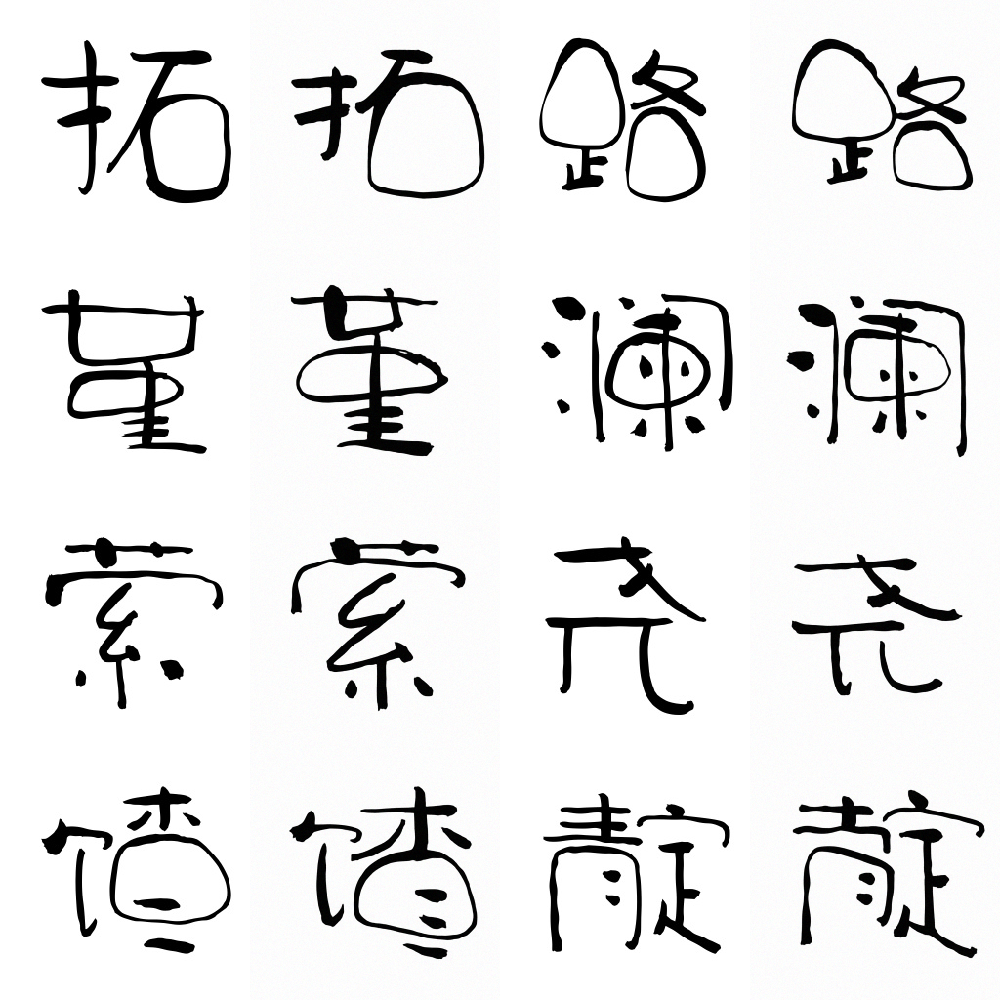
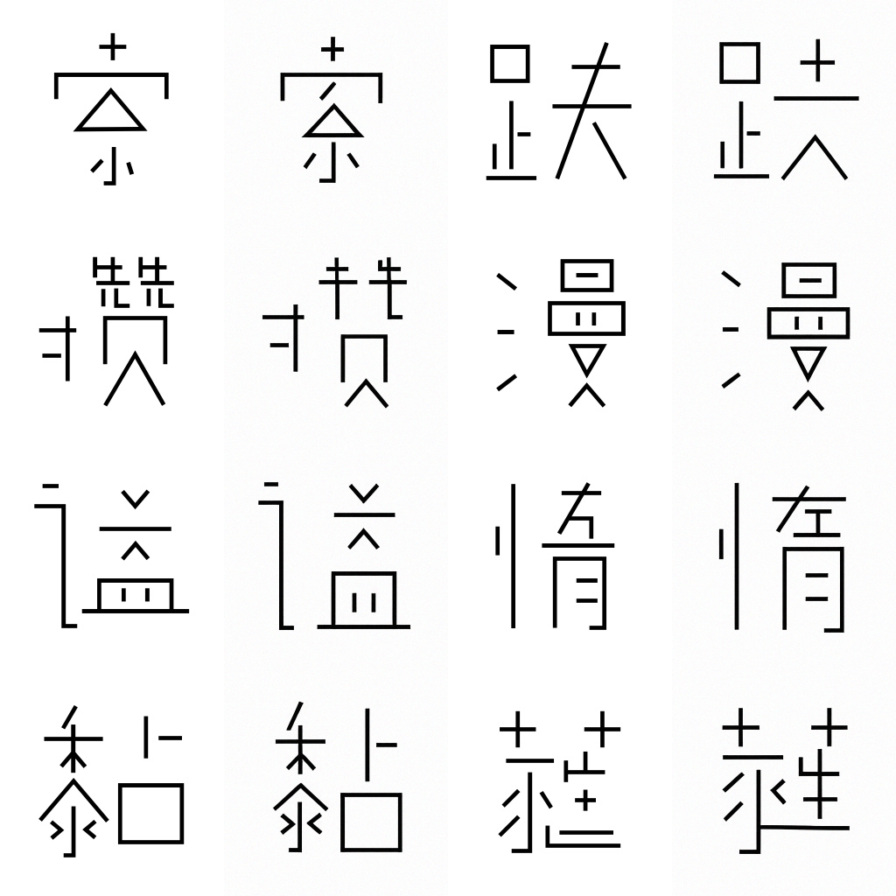
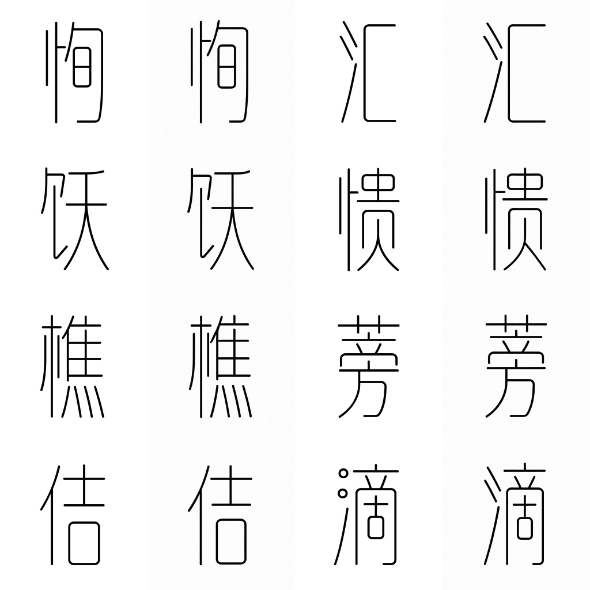

<p align="center">
  
</p>

<h2 align="center">zi2zi-JiT: Font Synthesis with Pixel Space Diffusion Transformers</h2>

<p align="center">
  <a href="README_zh.md">中文版</a>
</p>

<p align="center">
  
</p>

## Overview

<p align="center">
  
</p>

zi2zi-JiT is a conditional variant of [JiT](https://arxiv.org/abs/2511.13720) (Just image Transformer) designed for Chinese font style transfer. Given a source character and a style reference, it synthesizes the character in the target font style.

The architecture, illustrated above, extends the base JiT model with three components:

- **Content Encoder** — a CNN that captures the structural layout of the input character, adapted from [FontDiffuser](https://arxiv.org/abs/2312.12142).
- **Style Encoder** — a CNN that extracts stylistic features from a reference glyph in the target font.
- **Multi-Source In-Context Mixing** — instead of conditioning on a single category token as in the original JiT, font, style, and content embeddings are concatenated into a unified conditioning sequence.

### Training

Two model variants are available — JiT-B/16 and JiT-L/16 — both trained for 2,000 epochs on a corpus of over 400+ fonts (70% simplified Chinese, 20% traditional Chinese, 10% Japanese), totalling 300k+ character images. For each font, the max number of characters used for training is capped at 800

### Evaluation

Generated glyphs are evaluated against ground-truth references following the protocol in [FontDiffuser](https://arxiv.org/abs/2312.12142). All metrics are computed over 2,400 pairs.

| Model | FID ↓ | SSIM ↑ | LPIPS ↓ | L1 ↓ |
|-------|-------|--------|---------|------|
| JiT-B/16 | 53.81 | 0.6753 | 0.2024 | 0.1071 |
| JiT-L/16 | 56.01 | 0.6794 | 0.1967 | 0.1043 |

## How To Use

### Environment Setup

```bash
conda env create -f environment.yaml
conda activate zi2zi-jit
pip install -e .
```

### Download

Pretrained checkpoints are available on Google Drive:

**[Download Models](https://drive.google.com/drive/folders/1QJi2ihxDBK2NF-jCE07g59YwuUTAd-iY)**

Save desired checkpoint and place it under `models/`:

```bash
mkdir -p models
# zi2zi-JiT-B-16.pth  (Base variant)
# zi2zi-JiT-L-16.pth  (Large variant)
```

### Dataset Generation

#### From font files

Generate a paired dataset from a source font and a directory of target fonts:

```bash
python scripts/generate_font_dataset.py \
    --source-font data/思源宋体light.otf \
    --font-dir   data/sample_single_font \
    --output-dir data/sample_dataset
```

This produces the following structure:

```
data/sample_dataset/
├── train/
│   ├── 001_FontA/
│   │   ├── 00000_U+XXXX.jpg
│   │   ├── 00001_U+XXXX.jpg
│   │   ├── ...
│   │   └── metadata.json
│   ├── 002_FontB/
│   │   └── ...
│   └── ...
├── test/
│   ├── 001_FontA/
│   │   └── ...
│   └── ...
└── test.npz
```

Each `.jpg` is a 1024x256 composite: `source (256) | target (256) | ref_grid_1 (256) | ref_grid_2 (256)`.

#### From rendered glyph images

Alternatively, build a dataset from a directory of rendered character images.
Each file should be a 256x256 PNG named by its character:

```
data/sample_glyphs/
├── 万.png
├── 上.png
├── 中.png
├── 人.png
├── 大.png
└── ...
```

```bash
python scripts/generate_glyph_dataset.py \
    --source-font data/思源宋体light.otf \
    --glyph-dir   data/sample_glyphs \
    --output-dir  data/sample_glyph_dataset \
    --train-count 200
```

### LoRA Fine-Tuning

Fine-tune a pretrained model on a single GPU with LoRA. Fine-tuning a single font typically takes less than one hour on a single H100. The example below uses JiT-B/16 with batch size 16, which requires roughly 4 GB of VRAM:

```bash
python lora_single_gpu_finetune_jit.py \
    --data_path       data/sample_dataset/train/ \
    --test_npz_path   data/sample_dataset/test.npz \
    --output_dir      run/lora_ft_sample_single/ \
    --base_checkpoint models/zi2zi-JiT-B-16.pth \
    --model           JiT-B/16 \
    --num_fonts       1000 \
    --num_chars       20000 \
    --max_chars_per_font 200 \
    --img_size        256 \
    --lora_r          32 \
    --lora_alpha      32 \
    --lora_targets    "qkv,proj,w12,w3" \
    --epochs          200 \
    --batch_size      16 \
    --blr             8e-4 \
    --warmup_epochs   1 \
    --save_last_freq  10 \
    --proj_dropout    0.1 \
    --P_mean          -0.8 \
    --P_std           0.8 \
    --noise_scale     1.0 \
    --cfg             2.6 \
    --online_eval \
    --eval_step_folders \
    --eval_freq       10 \
    --gen_bsz         16 \
    --num_images      400 \
    --seed            42
```

**Key parameters:**

| Parameter | Note |
|---|---|
| `--num_fonts`, `--num_chars` | Tied to the pretrained model's embedding size. Do not change unless pretraining from scratch. |
| `--max_chars_per_font` | Caps the number of characters used from each font. |
| `--lora_r`, `--lora_alpha` | LoRA capacity. Higher values give more capacity at the cost of memory. |
| `--batch_size` | 16 uses ~4 GB VRAM. |
| `--cfg` | Conditioning strength. Use **2.6** for JiT-B/16, **2.4** for JiT-L/16. |

### Generation

Generate characters from a fine-tuned checkpoint:

```bash
python generate_chars.py \
    --checkpoint run/lora_ft_sample_single/checkpoint-last.pth \
    --test_npz   data/sample_dataset/test.npz \
    --output_dir run/generated_chars/
```

### Metrics

Compute pairwise metrics (SSIM, LPIPS, L1, FID) on the generated comparison grids:

```bash
python scripts/compute_pairwise_metrics.py \
    --device cuda \
    run/lora_ft_sample_single/heun-steps50-cfg2.6-interval0.0-1.0-image400-res256/step_10/compare/
```

## Works

Fonts created with zi2zi-JiT:

- [Zi-QuanHengDuLiang (权衡度量体)](https://github.com/kaonashi-tyc/Zi-QuanHengDuLiang)
- [Zi-XuanZongTi (玄宗体)](https://github.com/kaonashi-tyc/Zi-XuanZongTi)
- [Eva-Ming-Simplified (Eva明朝简体)](https://github.com/kaonashi-tyc/Eva-Ming-Simplified)

## Gallery

Ground truth on the left, generated one on the right

| | |
|:---:|:---:|
|  |  |
|  |  |
|  |  |

### License

Code is licensed under MIT. Generated font outputs are additionally subject to
the "Font Artifact License Addendum" in [LICENSE](LICENSE):

- commercial use is allowed
- attribution is required when distributing a font product that uses more
  than 200 characters created from repository artifacts

### References / Thanks

- [JiT: Back to Basics: Let Denoising Generative Models Denoise](https://arxiv.org/abs/2511.13720)
- [FontDiffuser: One-Shot Font Generation via Denoising Diffusion with Multi-Scale Content Aggregation and Style Contrastive Learning](https://arxiv.org/abs/2312.12142) ([code](https://github.com/yeungchenwa/FontDiffuser))

This project builds on code and ideas from:

- [FontDiffuser](https://github.com/yeungchenwa/FontDiffuser) — content/style encoder design and evaluation protocol
- [JiT](https://github.com/LTH14/JiT) — base diffusion transformer architecture

### Citation

```bibtex
@article{zi2zi-jit,
  title   = {zi2zi-JiT: Font Synthesis with Pixel Space Diffusion Transformers},
  author  = {Yuchen Tian},
  year    = {2026},
  url     = {https://github.com/kaonashi-tyc/zi2zi-jit}
}
```